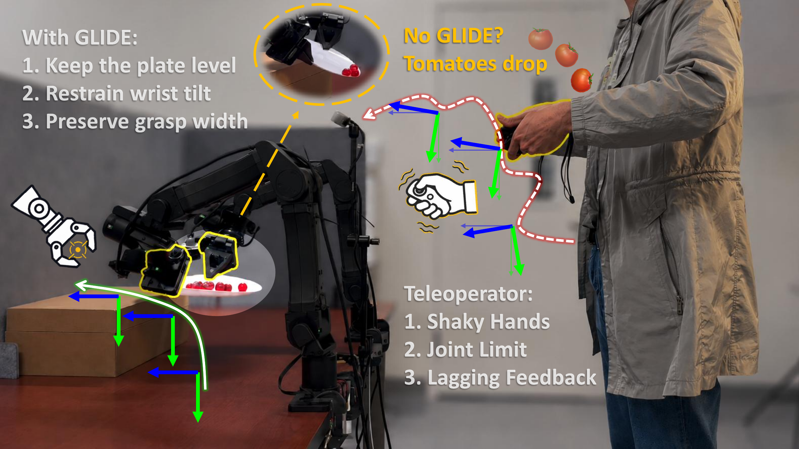

<h1 align="center"> GLIDE:<br/>
Learning Beyond What Humans Can Demonstrate</h1>

<p align="center">
    <a href="https://yuchen-song.github.io/"><strong>Yuchen Song</strong></a>
    ,
    <a href="https://adityamittal03.github.io/"><strong>Aditya Mittal</strong></a>
    ,
    <a href="https://unnat.github.io/"><strong>Unnat Jain</strong></a>
</p>

<p align="center">
    
</p>

<div align="center">

[](https://arxiv.org/abs/2609.24996)
[](https://guardrail-policy.github.io/)
[](https://huggingface.co/datasets/yuchensong/glide_data)
[](LICENSE)

</div>

<p align="center">
  
</p>

This repository contains the real-robot runtime for three tasks:

- **🍅 Tomato plate transfer:** use two grippers to carry a plate of tomatoes
  between surfaces without tilting the plate or spilling.
- **🖍️ Marker handover & stand:** pick up a marker, transfer it between grippers,
  place it upright, and withdraw without knocking it over.
- **🍷 Wine serving:** use a left parallel-jaw gripper to hold a bottle and a
  right 15-DoF CRAFT hand to hold a glass while pouring wine from bottle into glass.

## Real-Robot Workflow

### 1) Prerequisites


```bash
conda create -n glide python=3.11 -y
conda activate glide
python -m pip install -e "third_party/i2rt[spacemouse]"
python -m pip install -e third_party/openpi/packages/openpi-client
```

The runtime expects:

- Configured YAM CAN interfaces.
- Head, left-wrist, and right-wrist RealSense cameras.
- A Quest/Vuer setup for teleoperated data collection.
- A SpaceMouse for starting, saving, and resetting policy rollouts.
- CRAFT hand serial access for wine serving.
- Machine-local Quest TLS files at `third_party/i2rt/TeleVision/cert.pem` and
  `third_party/i2rt/TeleVision/key.pem`.

### 2) Configure Machine-Local Values

Copy the environment template, replace every required placeholder, and load it
in each robot terminal:

```bash
cp .env.example .env
source .env
```

| Variable | Required for | Description |
| --- | --- | --- |
| `GLIDE_HEAD_CAMERA_SERIAL` | All runs | Head RealSense serial. |
| `GLIDE_LEFT_WRIST_CAMERA_SERIAL` | All runs | Left-wrist RealSense serial. |
| `GLIDE_RIGHT_WRIST_CAMERA_SERIAL` | All runs | Right-wrist RealSense serial. |
| `GLIDE_POLICY_HOST` | Policy clients | Host running the OpenPI policy server. |
| `GLIDE_POLICY_PORT` | Policy clients | Server port; defaults to `8000`. |
| `GLIDE_POLICY_API_KEY` | Optional | Policy-server API key. |
| `GLIDE_QUEST_ADB_SERIAL` | Optional teleop setting | Quest ADB serial or network target. |
| `HF_LEROBOT_HOME` | Optional | Override the LeRobot dataset root. |
| `GLIDE_DATASET_OWNER` | Optional | File owner applied to CRAFT datasets. |


### 3) Public Flags and Defaults

Every public script requires:

| Flag | Meaning |
| --- | --- |
| `--repo-id` | LeRobot repository ID for the recorded episodes. |
| `--num-episodes` | Number of episodes to collect or evaluate. |
| `--task` | Natural-language task instruction and dataset label. |

Teleoperation mode flags are mutually exclusive:

| Teleop flags | Behavior |
| --- | --- |
| No mode flag | Naive, unguarded teleoperation. |
| `--manual` | Manually designed (domain expert hard-coded) guardrails. |
| `--glide` | Task-specific GLIDE guardrails. |

Policy mode selection is:

| Policy flags | Behavior |
| --- | --- |
| No mode flag | Unguarded policy rollout. |
| `--guarded` | Apply the task-specific GLIDE guardrails to policy actions. |

Additional launcher flags:

- `--task-profile marker|plate` overrides automatic task inference in
  `teleop.py` and `policy_client.py`. It is normally unnecessary when
  `--task` contains “marker,” “handover,” “plate,” or “tomato.”
- `--print-command` prints the resolved internal command using safe
  placeholders and exits without loading hardware dependencies.
- Unrecognized advanced arguments are forwarded to the selected internal
  runtime. Run the public script with `--help` for its stable interface.

## Data Collection

### 4) Two-Gripper Teleoperation

Use `scripts/teleop.py` for both the tomato plate and marker tasks. The launcher
infers the task profile from the instruction. This example collects GLIDE
marker demonstrations:

```bash
conda activate i2rt
source .env

python scripts/teleop.py \
  --repo-id data/marker_glide \
  --num-episodes 10 \
  --task "Pick up the marker with one gripper, transfer it to the other gripper, and lift it upright on the table." \
  --glide
```

For naive collection, omit `--glide`. Replace it with `--manual` for the
manual mode.

Quest controls:

- Right controller `A`: start teleoperation and episode recording.
- Left controller `X`: save the current episode.
- Left controller `Y`: discard the current episode; when idle, delete the
  previous saved episode.
- `Ctrl+C`: emergency stop.

### 5) CRAFT-Hand Teleoperation

Use `scripts/teleop_craft.py` for wine serving. It defaults to both YAM arms,
a left `linear_4310` gripper, a right `no_gripper` arm configuration, and CRAFT
hand drive mode:

```bash
conda activate i2rt
source .env

python scripts/teleop_craft.py \
  --repo-id data/wine_glide \
  --num-episodes 10 \
  --task "Use the left gripper to pick up the wine bottle, use the right hand to pick up the wine cup, and pour wine from the bottle into the cup." \
  --glide
```

Omit `--glide` for naive CRAFT teleoperation or replace it with `--manual` for
the manual guardrails.

Quest hand-gesture controls:

- Left fist: start or recalibrate.
- Hold left thumbs-up: save the current episode.
- Left middle finger: discard; when idle, delete the previous episode.
- Left pinky: stop.


## Policy Training and Serving

GLIDE uses OpenPI/π₀.₅ for behavior-cloning policies, with task-specific
configuration changes made directly from the OpenPI codebase. This repository
keeps only the lightweight `openpi-client` transport needed on the robot.

For environment creation, normalization statistics, fine-tuning, checkpoint
configuration, and serving, use the official
[Physical Intelligence OpenPI repository](https://github.com/Physical-Intelligence/openpi).
For a remote GPU policy server and robot-side client separation, also follow
OpenPI’s
[remote inference guide](https://github.com/Physical-Intelligence/openpi/blob/main/docs/remote_inference.md).
Start the policy server before running either client below, then set
`GLIDE_POLICY_HOST` and optionally `GLIDE_POLICY_PORT` in `.env`.

## Policy Evaluation

### 6) Two-Gripper Policy Client

Use `scripts/policy_client.py` for marker or tomato plate policies. No mode
flag runs the policy unguarded; `--guarded` filters policy actions through the
matching GLIDE guardrail:

```bash
conda activate i2rt
source .env

python scripts/policy_client.py \
  --repo-id eval/plate_guarded \
  --num-episodes 10 \
  --task "Lift the plate holding the tomatoes and place it on the elevated target surface without spilling them." \
  --guarded
```

The launcher uses an action horizon of `10`, all
three cameras, and the two-gripper configuration by default.

### 7) CRAFT-Hand Policy Client

Use `scripts/policy_client_craft.py` for wine-serving policies:

```bash
conda activate i2rt
source .env

python scripts/policy_client_craft.py \
  --repo-id eval/wine_guarded \
  --num-episodes 10 \
  --task "Use the left gripper to pick up the wine bottle, use the right hand to pick up the wine cup, and pour wine from the bottle into the cup." \
  --guarded
```

The CRAFT policy launcher defaults to an action horizon of `50`, a `45 Hz`
control frequency, all three cameras, the left gripper/right CRAFT
configuration, and CRAFT hand drive mode. Omit `--guarded` for an unguarded
policy rollout.

SpaceMouse controls for both policy clients:

- Right SpaceMouse button 1: start policy motion and begin recording.
- Right SpaceMouse button 2: save the episode and reset to the ready pose.
- On the CRAFT client, pressing button 1 during an active episode discards the
  episode and resets.
- `Ctrl+C`: emergency stop.

## Complete Command Matrix

All 15 task/mode combinations are collected in [`run.txt`](run.txt). The mode
matrix is:

| Task | Task selection | Naive teleop | Manual teleop | GLIDE teleop | Unguarded policy | Guarded policy |
| --- | --- | --- | --- | --- | --- | --- |
| 🍅 Tomato plate transfer | `--task-profile plate`, or `plate`/`tomato` in `--task` description | `teleop.py` | `teleop.py --manual` | `teleop.py --glide` | `policy_client.py` | `policy_client.py --guarded` |
| 🖍️ Marker handover & stand | `--task-profile marker`, or `marker`/`handover` in `--task` description | `teleop.py` | `teleop.py --manual` | `teleop.py --glide` | `policy_client.py` | `policy_client.py --guarded` |
| 🍷 Wine serving | Dedicated CRAFT launcher; no profile required | `teleop_craft.py` | `teleop_craft.py --manual` | `teleop_craft.py --glide` | `policy_client_craft.py` | `policy_client_craft.py --guarded` |

## Repository Layout

- `scripts/`: the four public data-collection and policy-client launchers.
- `glide_runtime/`: launcher utilities and internal policy runtimes.
- `third_party/i2rt/glide_runtime/`: internal two-gripper teleoperation
  implementations.
- `third_party/i2rt/i2rt-craft-hand/`: internal CRAFT teleoperation
  implementations.
- `third_party/i2rt/i2rt/`: robot, motor, kinematics, and model support.
- `third_party/i2rt/TeleVision/`, `i2rt-hand/`, and `craft-hand/`: minimal
  Quest and CRAFT support.
- `third_party/openpi/packages/openpi-client/`: client-only OpenPI transport.


## Acknowledgements

This repository builds upon
[OpenPI](https://github.com/Physical-Intelligence/openpi),
[Open-TeleVision](https://github.com/OpenTeleVision/TeleVision),
[i2rt](https://github.com/i2rt-robotics/i2rt), and
[CRAFT Hand](https://craft-hand.github.io/). We thank their authors and
maintainers.

## Citation

```bibtex
@article{song2026glide,
  title={Learning Beyond What Humans Can Demonstrate},
  author={Song, Yuchen and Mittal, Aditya and Jain, Unnat},
  journal={arXiv preprint arXiv:2609.24996},
  year={2026}
}
```
